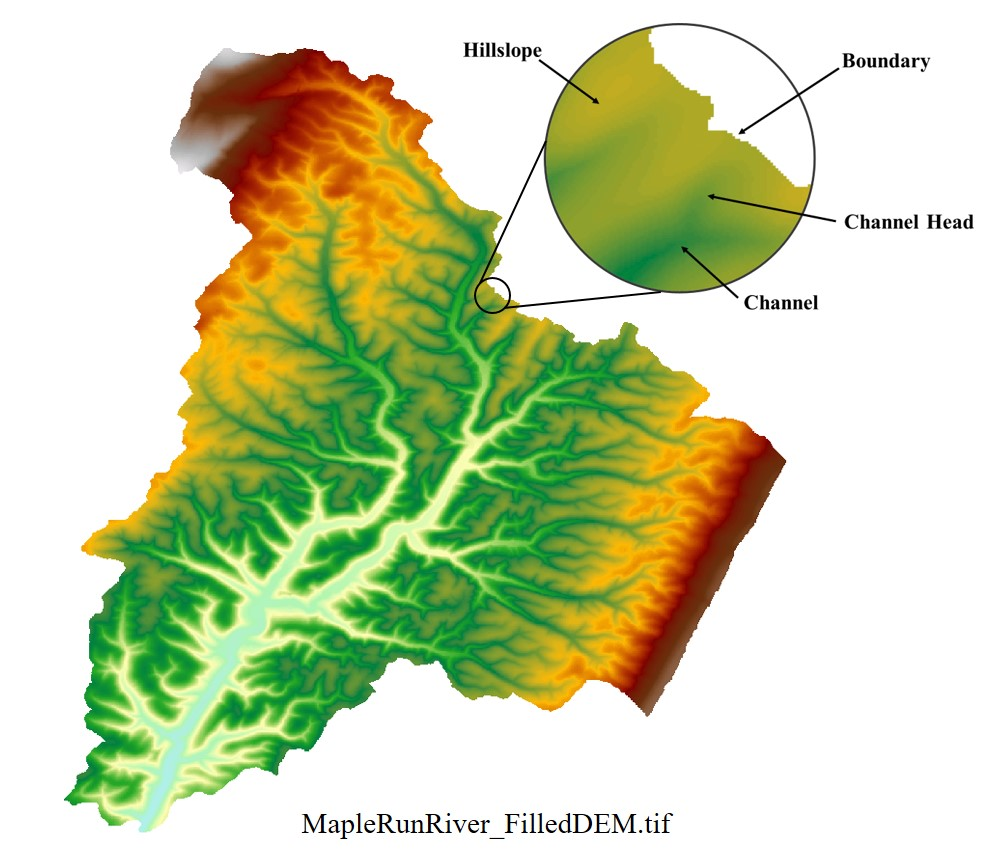
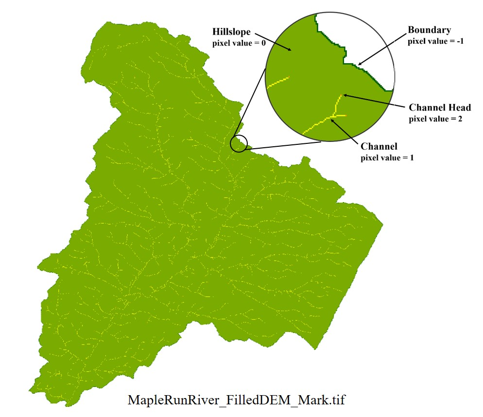

### Tsinghua DNE (Drainage Network Extraction) Program with Channel Head Detection

This program is used for drainage network extraction from DEM data, based on the least-cost-search algorithm realized using a size-balanced-binary-tree (see the reference below) to speed-up computation, improved with a channel head recognition method using a geomorphologic change point detection algorithm to provide an alternative for the existing Critical-Sourcing-Area (CSA) method.

The program is completed by the team led by Prof. Guangqian Wang at the [State Key Laboratory of Hydroscience and Engineering](http://sklhse.tsinghua.edu.cn/) and also the [Department of Hydraulic Engineering](http://www.civil.tsinghua.edu.cn/en/he/) in [Tsinghua University](http://www.tsinghua.edu.cn/publish/newthuen/index.html). The copyright of this program belongs to Tsinghua University. The program and source code is allowed for scientific research, but is not allowed for commercial activities without permission.

The core program was completed by Rui Bai in year 2014, through using the size balanced binary tree to speed-up the extraction of drainage networks based on the state-of-the-art least-cost-search method (see publication: [Bai R, Li T, Huang Y, et al. An efficient and comprehensive method for drainage network extraction from DEM with billions of pixels using a size - balanced binary search tree. Geomorphology, 2015, 238:56-67](https://www.sciencedirect.com/science/article/pii/S0169555X15001233)).

Jiaye Li et al. proposed a channel head recognition method using geomorphologic change point detection algorithm to improve the accuracy of drainage network extraction, which aims to provide an alternative for the traditional CSA method, and is submitted to the journal of Environmental Modelling & Software for the consideration of publication. The source code of this work is incorporated with Bai's existing program, which are provided here together.

Rui Bai won his PhD degree in year 2015, and now works in Chengdu Engineering Corporation Limited of Power China. Jiaye Li is currently a Post-doctoral in Tsinghua University. The directors of their work are Associate Professor Tiejian Li and Professor Yuefei Huang.

The program is coded in C++ language. This uploaded project (in the /DNE folder) was created by Microsoft Visual Studio 2015, and some Microsoft library functions are used. If a user needs to use the source code in other environments, some minor alterations should be made.

### Contacts

|Author|Rui Bai|Jiaye Li|
|:---:|:---:|:---:|
|E-mail|marybr66@126.com|li_jy@mail.tsinghua.edu.cn|

|Author|Tiejian Li|Yuefei Huang|
|:---:|:---:|:---:|
|E-mail|litiejian@tsinghua.edu.cn|yuefeihuang@tsinghua.edu.cn|

### Usage

A compiled Windows exe file can be found in the /Sample folder.
The program runs in the command line mode.
There are five input parameters in all, including the compulsory DEM_data_file_path and four optional parameters that must be provided together.

    DNE.exe DEM_data_file_path [Critical_A_Sq_S Critical_A_over_Sq_L Window_Shift_Proportion Confidence_p_Value]

    examples:
    DNE.exe Sample.tif
    DNE.exe Sample.tif 600 0.2 0.25 0.05

The program will create a folder named same as the inputted DEM file and save the result file in it. Both of the input DEM and result data are in the uncompressed TIFF format, the samples can be found in the /Sample folder, and is shown as follows.

|#|Input & Output|Figures|
|:---:|:---:|:---:|
|1|Input: DEM data (.tif file, uncompressed format)||
|2|Output: Channel Mark (.tif file, uncompressed format)||

### Notice

The input DEM data should have no depression in this program. We are still working with the depression-filling and depression-over-topping methods, but the codes are not provided at the current stage. For those who are interested in this topic, please see the aforementioned publication or contact us.

We can also create the GIS feature result and calculate the geometric properties of river reaches in the drainage networks, see another paper ([Bai R, Li T, Huang Y, et al. A hierarchical pyramid method for managing large-scale high-resolution drainage networks extracted from DEM. Computers & Geosciences, 2015, 85(PA):234-247](https://www.sciencedirect.com/science/article/pii/S0098300415300042)) for reference or contact us for more details.
